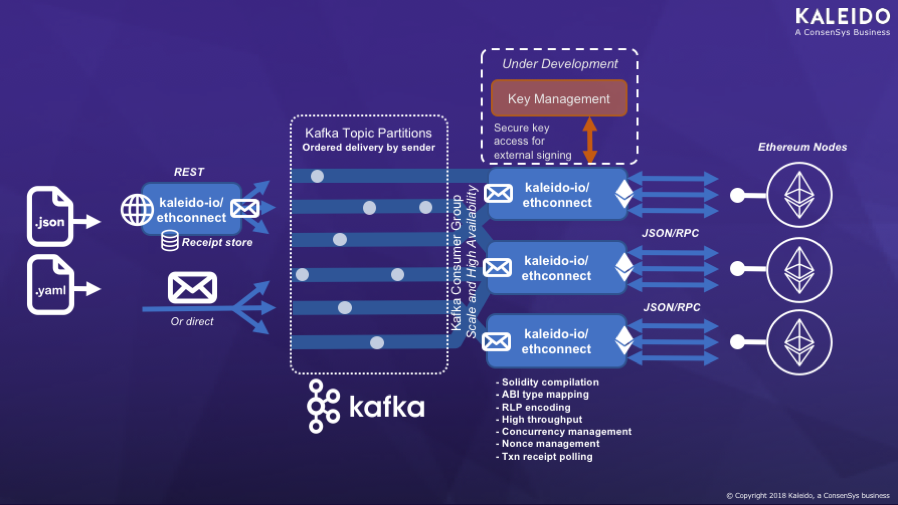

# github.com/kaleido-io/ethconnect

[](https://codecov.io/gh/kaleido-io/ethconnect)

Open Source component that is used as part of [Kaleido Connect](https://kaleido.io).

A Web and Messaging API, taking the hassle out of submitting Ethereum transactions:
- Solidity compilation
- ABI type mapping
- RLP encoding
- Transaction receipt polling
- High throughput tx submission
- Concurrency management
- Nonce management

Provides an integration bridge into Ethereum permissioned chains, from simple
Web Service and Messaging interfaces that are friendly to existing Enterprise
applications & middleware.
For example to allow connectivity from an Enterprise Service Bus (ESB) or other
Enterprise Application Integration (EAI) tier, or applications running in a
Java EE Application Server.



Technology support currently includes:
- Messaging
  - Apache Kafka - https://kafka.apache.org/
- Webhooks
  - Simple POST of a transaction over HTTP in YAML/JSON queued to Kafka for processing

Under development:

- Key Management Service
  - AWS Key Management Service - https://aws.amazon.com/kms/

## License

This code is distributed under the [Apache 2 license](LICENSE).

> The code statically links to code distributed under the LGPL license.

## Example payloads

The HTTP Webhooks and Kafka message payloads share a common schema.
For HTTP you can specify `Content-type: application/x-yaml` and send
in a YAML payload, which will be converted to JSON.

When sending messages to Kafka directly, JSON must be sent.

### YAML to submit a transaction

Send a transaction with parameters to an existing deployed contract.

```yaml
headers:
  type: SendTransaction
from: 0xb480F96c0a3d6E9e9a263e4665a39bFa6c4d01E8
to: 0xe1a078b9e2b145d0a7387f09277c6ae1d9470771
params:
  - value: 4276993775
    type: uint256
gas: 1000000
methodName: set
```

### YAML to deploy a contract

Ideal for deployment of simple contracts that can be specified inline (see #18).

```yaml
headers:
  type: DeployContract
from: '0xb480F96c0a3d6E9e9a263e4665a39bFa6c4d01E8'
params:
  - 12345
gas: 1000000
solidity: |-
  pragma solidity ^0.4.17;
  
  contract simplestorage {
     uint public storedData;
  
     function simplestorage(uint initVal) public {
        storedData = initVal;
     }
  
     function set(uint x) public {
        storedData = x;
     }
  
     function get() public constant returns (uint retVal) {
        return storedData;
     }
  }
```

## Why put a Web / Messaging API in front of an Ethereum node?

The JSON/RPC specification exposed natively by Go-ethereum and other Ethereum
protocol implementations, provides a rich low-level API for interfacing with
the node. It is usually exposed over HTTP (as well as IPC) so can be connected
over a network, and have security layered in front of it (as has been down within
the Kaleido platform).

However, applications seldom code directly to the JSON/RPC API when deploying
contracts and sending transactions, because it is:
- Asynchronous in nature, needing polling to obtain a transaction receipt
- Based on Recursive Length Prefix (RLP) encoding of payloads

Instead thick client libraries such as [web3.js](https://github.com/ethereum/web3.js/) (web3j)[https://github.com/web3j/web3j], (web3.py)[https://github.com/ethereum/web3.py], (Nethereum)[https://github.com/Nethereum/Nethereum] and [ethjs](https://github.com/ethjs/ethjs) are used to submit transactions.

These thick client libraries perform many of the same functions as kaleido-io/ethconnect, simplifying submission of transactions, receipt checking,
nonce management etc.

In the modern world of Microservice architectures, having a simple, efficient 
and stateless REST API to submit transactions is a desirable alternative. A small self-contained, optimized, and independently scalable layer that can exposing a simple API that can be consumed by any application, programming language, or Integration tool.

e.g. making it trivial to submit transactions. No coding required, just open up Postman and send in a trivial piece of YAML copied from a README like this one.

In an Enterprise context, the availability of simple standardized interfaces like HTTP and Kafka means applications and integration tools (a common ESB or other EAI tooling) can be hooked up trivially. No need to insert complex code libraries into applications,
many of which are LGPL licensed.

## Why Messaging?

So you ask, if the goal is simplicity, why not just put a simplified HTTP API in front
of JSON/RPC and be done with it?

There are some challenges in Enterprise grade Blockchain solutions (particularly in high throughput permissioned/private chains) that cannot be solved by a stateless
HTTP bridging layer alone.

### The asynchronous nature of transactions

Transactions can take many seconds or minutes (depending on the backlog and block period) between submission and a receipt being available.

An Ethereum Blockchain using a byzantine fault tolerant consensus algorithm
such can be tuned to a high throughput in the hundreds of txns/second, and
give finality of those transactions once they are committed to blocks.
However, the _latency_ of those transactions will be high.

Equally spikes in workload might occur that create a queue of transactions that need to be drip-fed into the Ethereum network at a lower rate.

Connecting a synchronous blocking HTTP interface directly to an inherently asynchronous system causes problems. The HTTP request times out, but the caller has no way to 
revoke the request that has already been submitted. It does not know if it should retry
or if the transaction will eventually succeed. It cannot cancel it.

This is fundamentally why the JSON/RPC API has separate calls to submit transactions, and check for receipts. The Ethereuem nodes hence have a queue built into them. However, this queue is a finite buffer, and constrained to an individual node. Messaging allows us to provide the same benefits in high throughput scalable Enterprise system.

### Scale and message ordering

The built-in queuing within an Ethereum node is based upon the concept of a `nonce`, which must be incremented by exactly one each time a transaction is submitted from the same
Ethereum address.

## Why Kafka?
